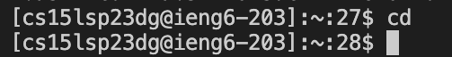

Welcome new CSE 15L students (and future Anvita :))! The blog post below will be detailing a series of steps that describe how to do the following: installing VS code, connecting to a remote server and using various commands.

## Installing VS Code
If you do not have VS code already, follow this link https://code.visualstudio.com/ and go through the instructions in order to install it on your computer. When you open up the application, your screen should be similar to the image below.

## Logging into your account and remotely connecting

1. First, we will need to find your CSE 15L account. You can use this link [Link](https://sdacs.ucsd.edu/~icc/index.php) to search up your account.

2. The 9 character phrase beginning with "cs15lsp.." is your username; the last two characters will be different for every account. Click 'change your password for this account' and use this username. The site will ask you to confirm your email and then it will send a password reset page to your email. From this, you will be able to change your password. When this page shows up, your password has been sucessfully changed!

3. To use ssh, use this command in terminal of VSCode `$ ssh cs15lsp23zz@ieng6.ucsd.edu`. Remember, the last two characters (zz) will be replaced by the characters of your account username. To open the terminal, use Ctrl or Command + `, or use the Terminal menu option and then click.
4. You will get a message that asks 'Are you sure you want to continue connecting'. Enter 'yes' and then enter your password after. If you have successfully connected to a remote server, you should get the output below in the terminal. If it does not work immediately, wait 15-20 minutes for your password change to go through properly and then try again. By doing this, you have connected to a computer in the CSE basement, so the commands you run will also run on the remote server.

## Running Commands

Now try running a few commands in the terminal. These commands should be run on the remote server (using ssh) and on your own computer. Some commands that you can run include 
1. `cd` - The cd commands allow you to move between directories. It will take in an argument which is the file that you want to move to.
2. `cd ~` 
3. `ls -a` - The ls commands show the contents of your current working directory. It will list names and features of the files.
4. `ls -lat`
5. `ls /home/linux/ieng6/cs15lsp23/cs15lsp23abc` (where abc is your username)
6. `cp /home/linux/ieng6/cs15lsp23/public/hello.txt ~/` - The cp command creates a copy of the contents of the file or directory you are in.
7. `cat /home/linux/ieng6/cs15lsp23/public/hello.txt` - The cat command prints the contents of a file.

To check if it is working properly, you should see similar outputs as shown below.

