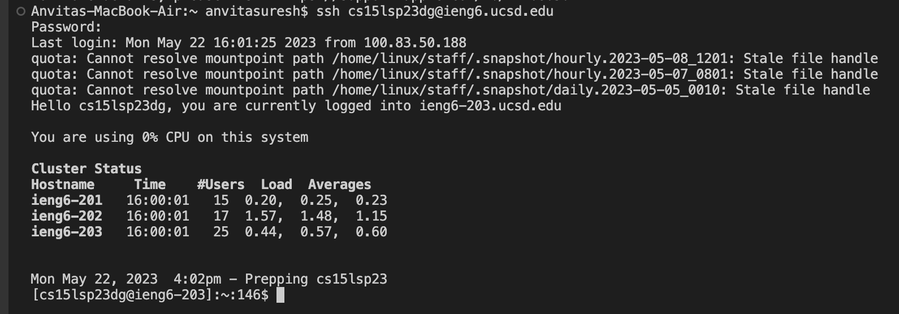
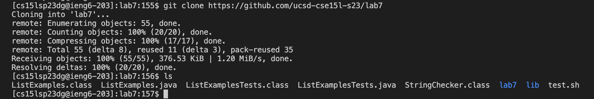
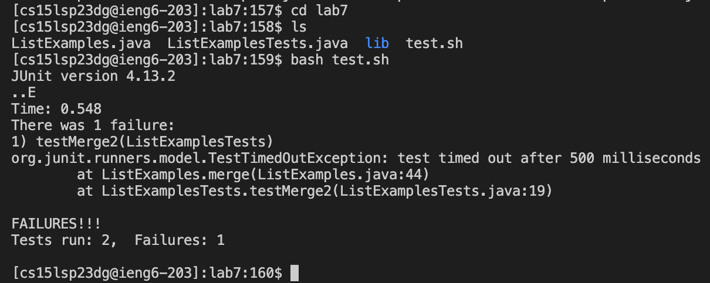
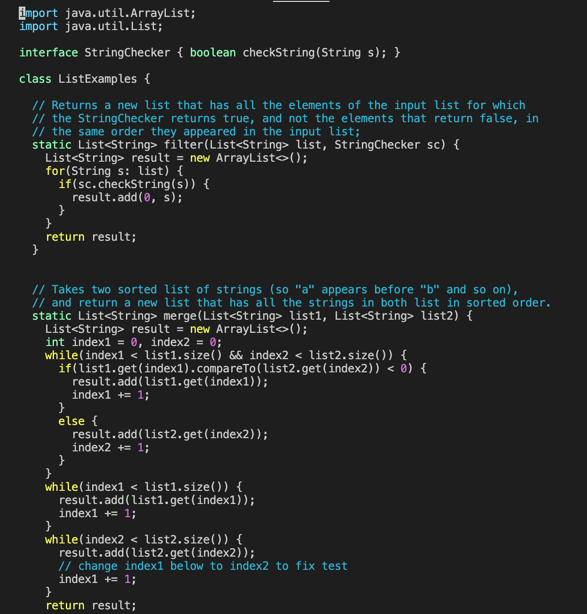
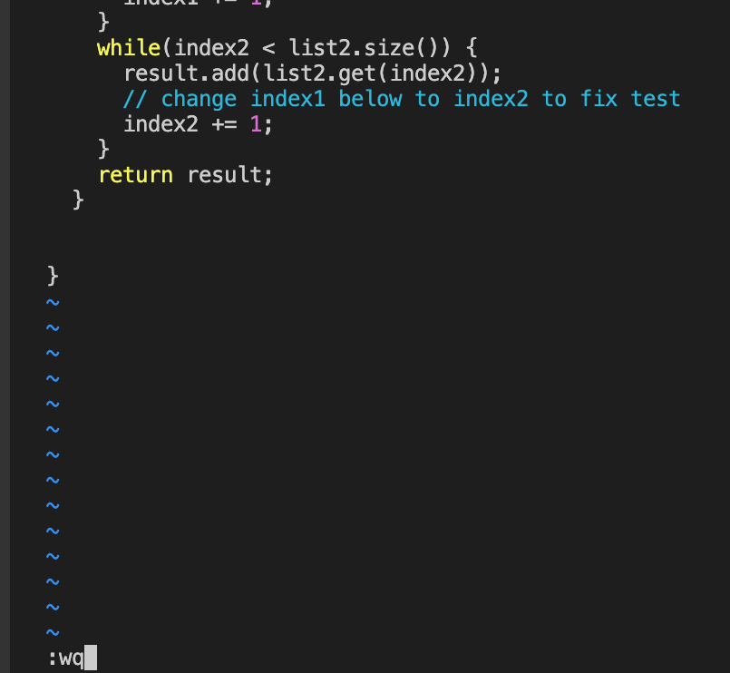
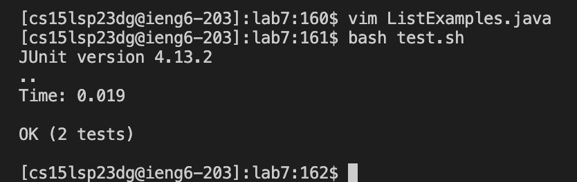
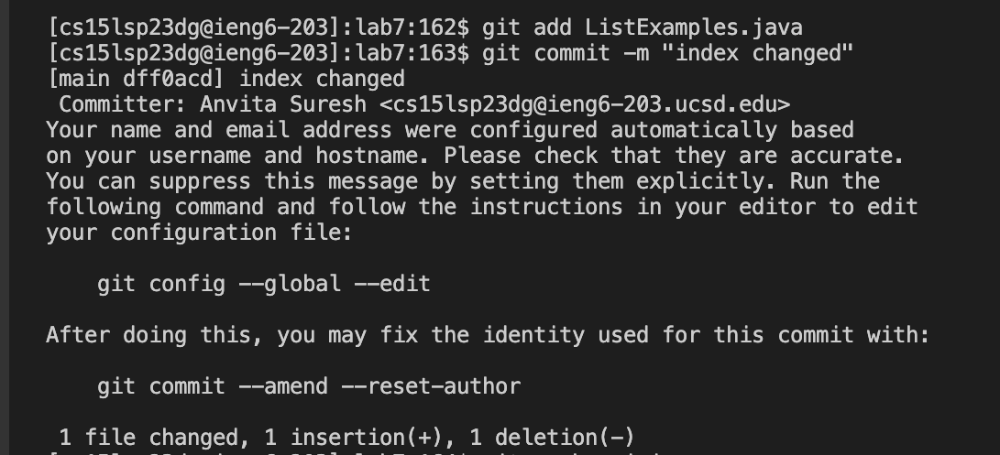

# Editing from the Command Line with Vim

Welcome back! For today's tutorial, we will be going over how to make edits through the command line using Vim.

## Step 1: Log into ieng6
First, log into your CSE 15L student account. To do this type in `ssh cs15lsp23zz@ieng6.ucsd.edu` into the command line where zz is replaced by your personal account digits.
Keys pressed: <CTRL>(hold) <V>(had 'ssh cs15lsp23dg@ieng6.ucsd.edu' copied beforehand) <ENTER>

  
## Step 2: Clone your fork of the repository from your Github account
Next, to clone a fork of the repository, type in `git clone https://github.com/ucsd-cse15l-s23/lab7` into the command line.
Keys pressed: <CTRL>(hold) <V>(had 'git clone https://github.com/ucsd-cse15l-s23/lab7' copied beforehand) <ENTER> <l> <s> <ENTER>

## Step 3: Run the tests, demonstrating that they fail
Next, you want to make sure you are in the lab7 directory and see what files are inside. Then, we can run the tests inside of 'ListExamples.java' to see which tests are passing and which are failing.
Keys Pressed: <c> <d> <l> <a> <b> <7> <ENTER> <l> <s> <ENTER> <b> <a> <s> <h> <SPACE> <t> <e> <s> <t> <.> <s> <h> <ENTER>

## Step 4: Edit the code file ListExamples.java to fix the failing test 
Now, beofre we actually edit the code, use the following commands below to enter vim.
Keys Pressed: <v> <i> <m> <SPACE> <SHIFT>(hold) <l> <i> <s> <t> <SHIFT>(hold) <e> <x> <a> <m> 
 <l> <e> <s> <.> <j> <a> <v> <a>
Your screen should look like the image below.

Click <ESC> to make sure you are in normal mode. To edit the code now, follow the commands below.
Keys Pressed: </> <i> <n> <d> <e> <x> <1> <ENTER> <N> <e> <x> <i> <2> <ESC> <SHIFT>(hold) <;> <w> <q> <ENTER>
Before you click the last enter, your screen should look like the image below.

## Step 5: Run the tests, demonstrating that they now succeed
Keys Pressed: <b> <a> <s> <h> <SPACE> <t> <e> <s> <t> <.> <s> <h> <ENTER>

## Step 6: Commit and push the resulting change to your Github account
To commit and push, you want to type the following three commands into the command line.
 `git add ListExamples.java` - adds the file to the repository
 `git commit -m "index changed"` - commits the new file with the message "index changed"

 `git push origin` - publishes local changes and commits them to the repository
Keys Pressed: <g> <i> <t> <a> <d> <d> <L> <i> <s> <t> <E> <x> <a> <m> 
 <l> <e> <s> <.> <j> <a> <v> <a> <ENTER> <g> <i> <t> <c> <o> <m> <m> <i> <t> <-> <m> <"> <i> <n> <d> <e> <x> <c> <h> <a> <n> <g> <e> <d> <"> <ENTER> <g> <i> <t> 
 <u> <s> <h> <o> <r> <i> <g> <i> <n> 

