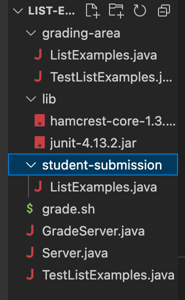

# Debugging
Today, we will be designing a debugging scenario by simulating a conversation that a student has with their TA regarding a problem with their code. 

## Part 1 – Debugging Scenario

### The Student's Question
Below is the conversation between the student and TA via edstem, where the student highlights the issue they had when running their bash script from lab6. 

Here are closer images of the bash script and output for better viewing :)

### The TA's Response

### Student's Fix
The student used the response from the TA and realized where their error occurs. After checking their current directory and seeing that it was actually grading-area, they saw that lib was not inside of this directory. Since lib stores the JUnit and hamcrest files, there will be an error in the terminal when running the bash script that the package does not exist. To fix this error, the student added `cp -r ../lib .` to line 21 in grade.sh which moves lib into grading-area and allows for the bash script to run and compile without error. 

Before fixing the bash script: 

After fixing the bash script:

Here is the correct output and the edit to the bash script that the student made given the TA's feedback:

### Additional Information

Here we can see the files that were inside of list-examples-grader-main and lib. Since lib contains the JUnit and hamcrest files, they need to be under grading-area or else the error that the package does not exist will appear. To fix the bug, the student needed to add `cp -r ../lib .` to the bash script file in order for it to actually run the tests in ListExamples.java.

## Part 2 – Reflection
One thing that I found very interesting from the second half of this quarter was the concept of Vim. This application quite interesting because it allowed you to edit the file from the terminal and you didn't even have to be in the file to edit it! I did not realize how useful this is with the idea of remote servers and it makes sense why this application is widely used in software engineering. It is much more effient to use than editing the file directly and I am looking forward to exploring more with this tool as I move into higer level classes :)

